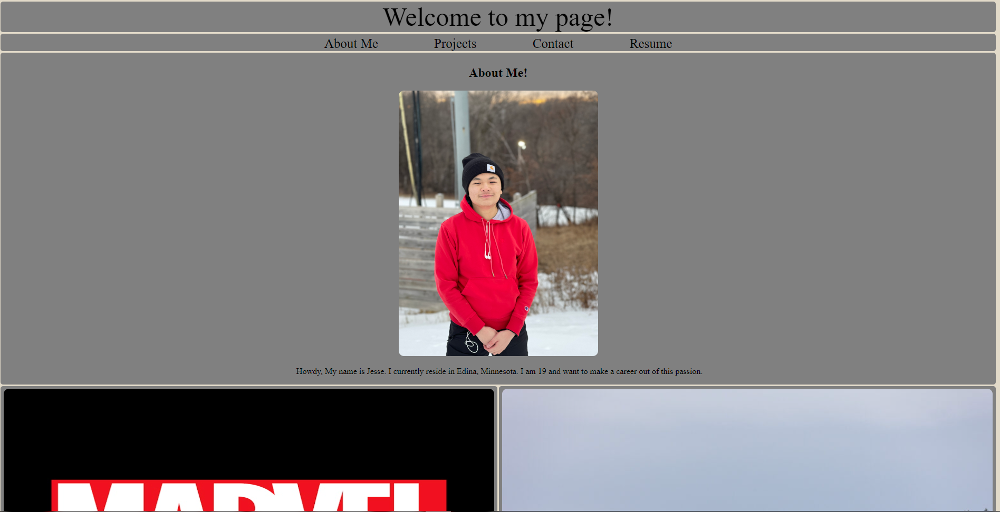

# The-Story-Of-J

# Disclaimer
Page is suited for 1920x1080. Not 2560x1440 or greater.

## Description

- The feeling of seeing the final result.
- To test my boundary and creativity.
- It gave me an outlet to express myself and my work.
- Trial and error and efficiently researching methods and resources. 

## Table of Contents

- [Installation] (#installation)
- [Usage] (#usage)
- [Credits] (#credits)
- [License] (#license)
- [Feature] (#feature)

# Installation
Enter Github > Hit Green "Code" Button > Inside the clone drop down box select method of cloning(https, ssh, github CLI) > If cloning by SSH open a terminal or git inside enter > $ git clone (the ssh) > Then Viola

# Usage
```md

```
#credits
I would like to give credit to the past recordings of class, homeworks, W3 resources and youtube videos. While I would like to take credit for this work. Good chunk of this came from 1 video. https://bit.ly/3UKG6sL . While there we're more I can not find the rest of my resources.

# License
MIT License

Copyright (c) 2022 JuicinessJ

Permission is hereby granted, free of charge, to any person obtaining a copy
of this software and associated documentation files (the "Software"), to deal
in the Software without restriction, including without limitation the rights
to use, copy, modify, merge, publish, distribute, sublicense, and/or sell
copies of the Software, and to permit persons to whom the Software is
furnished to do so, subject to the following conditions:

The above copyright notice and this permission notice shall be included in all
copies or substantial portions of the Software.

THE SOFTWARE IS PROVIDED "AS IS", WITHOUT WARRANTY OF ANY KIND, EXPRESS OR
IMPLIED, INCLUDING BUT NOT LIMITED TO THE WARRANTIES OF MERCHANTABILITY,
FITNESS FOR A PARTICULAR PURPOSE AND NONINFRINGEMENT. IN NO EVENT SHALL THE
AUTHORS OR COPYRIGHT HOLDERS BE LIABLE FOR ANY CLAIM, DAMAGES OR OTHER
LIABILITY, WHETHER IN AN ACTION OF CONTRACT, TORT OR OTHERWISE, ARISING FROM,
OUT OF OR IN CONNECTION WITH THE SOFTWARE OR THE USE OR OTHER DEALINGS IN THE
SOFTWARE.

# Feature
To keep my sanity I left a few "funny" jokes inside my work. Was gonna do more but would've been too much. 
